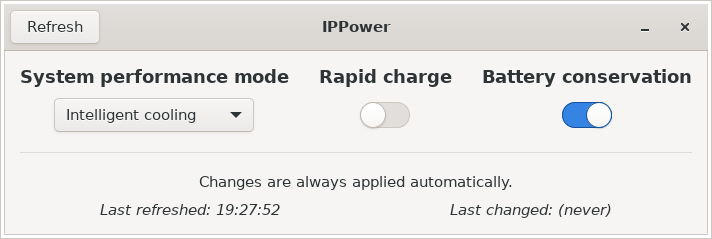

# IPPower
IPPower is a straightforward GUI (GTK) utility and a Python library that allows you to control the following power options of various Lenovo IdeaPad laptops from **Linux**-based operating systems:

- system performance mode
- rapid charge
- battery conservation



On Microsoft Windows, those options can be controlled using the *Lenovo Vantage* app.


---


## Disclaimer
The library performs direct ACPI calls **which can mess things up**, if not used properly or on unsupported hardware. This library and GUI utility come with ABOSULUTELY NO WARRANTY and both the author and contributors do not take any responsibility for any caused damage.

Tested on AMD Ryzen Renoir-based **Lenovo IdeaPad 3-15ARE05** (*81W40053CK* - Czech/Slovak SKU, see [PSREF](https://psref.lenovo.com/Detail/IdeaPad/IdeaPad_3_15ARE05?M=81W40053CK)) with Debian Bullseye and Arch Linux.


---


## Getting it up and running
1. **Install required packages**

  * Debian, Ubuntu and derivatives:
    ```
    sudo apt install git python3 python3-gi acpi-call-dkms
    ```
  * Arch Linux:
    ```
    sudo pacman -S git python acpi_call
    ```

  Since you are installing the `acpi_call` kernel module, you will need to disable Secure Boot in most cases.


2. **Clone the repository**
  ```
  git clone https://github.com/ethernetlord/ippower.git
  ```


3. **Run the program**

  In the directory where the repository has been cloned to, run:
  ```
  sudo ./ippower-gtk.py
  ```


---


## Author
Made by **EthernetLord**.
* Website: https://ethernetlord.eu/
* GitHub: @ethernetlord (https://github.com/ethernetlord/)
* Twitter: @ethernetlordcz (https://twitter.com/ethernetlordcz)

The library is based on commands published on the Arch Linux Wiki: [Lenovo IdeaPad 5 15are05](https://wiki.archlinux.org/index.php/Lenovo_IdeaPad_5_15are05#Tips_and_tricks)


## Licensing
Both the GUI utility and the Python library are licensed under **GNU GPLv3**. Full license is available in the [LICENSE](LICENSE) file.


## Contributing
If you want to remind me of any bugs or fix them right away, add some new functionality or just make something better, feel free to create a pull request or an issue.
